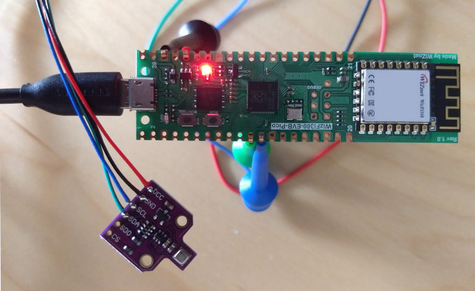

#  WIZnet WizFi360 Contest 2022
## WiFi Connected Environmental Sensor
## by Nico Maas (2022)

## Overview
The following project pairs an WizFi360-EVB-Pico with a Bosch BME680 to allow for an WiFi powered environmental sensor which can register temperature, humidity, air pressure and air quality levels and sent it via MQTT to e.g. an InfluxDB / Grafana instance.



## Hardware

You'll need

* 1x WizFi360-EVB-Pico
* 1x BME680 module
* 1x 5V Micro USB power supply / phone charger

### Setup
Connect the BME680 to the WizFi360-EVB-Pico using the [Pinout](https://docs.wiznet.io/Product/Open-Source-Hardware/wizfi360-evb-pico#pin-out)

* GND to GND (Pin Number 38)
* 3v3 to 3v3 (Pin Number 36)
* SDA to I2C0 SDA (GP8 / Pin Number 11)
* SCL to I2C0 SCL (GP9 / Pin Number 12)

## Software

### Arduino

#### used libraries

* [earlephilhower arduino-pico](https://github.com/earlephilhower/arduino-pico) @ 2.3.3
* [WizFi360](https://github.com/Wiznet/WizFi360_arduino_library) @ current version
* [Adafruit BME680](https://github.com/adafruit/Adafruit_BME680) @ 2.0.2
* [ArduinoJson](https://github.com/bblanchon/ArduinoJson) @ 6.19.4

#### re-used examples

* WizFi360: ConnectWPA
* [BME680 Air Quality](https://draeger-it.blog/arduino-lektion-113-umweltsensor-bme680-fuer-rel-luftfeuchtigkeit-luftdruck-temperatur-und-luftqualitaet/)

#### Prework and Update Firmware

* Install the needed libraries above
* Download and open the Software/WizFi360Callback/WizFi360Callback.ino
* Upload it to the board by using the WIZnet WizFi360-EVB-Pico as board
* Open the terminal after upload, change it to "115200 BAUD" and "NL as well as CR" options
* Start the update firmware procedure below

````
// enter
AT
// you should get back
// -> OK

// enter
AT+CWMODE_CUR=1
// you should get back
// -> OK

// enter
AT+CWDHCP_CUR=1,1
// you should get back
// -> OK

// you can now scan the area for available WiFi Accesspoints
AT+CWLAP

// connect to your WiFi, change the <NAME> and <PASSWORD> with
// your WiFis data
AT+CWJAP_CUR="<NAME>","<PASSWORD>"
// you should get back
// -> WIFI CONNECTED
// -> WIFI GOT IP
// -> OK

// you can check the IP of your WizFi360 with
AT+CIPSTA_CUR?
// you should get back
// -> +CIPSTA_CUR:ip:"x.x.x.x"
// -> +CIPSTA_CUR:gateway:"x.x.x.x"
// -> +CIPSTA_CUR:netmask:"x.x.x.x"
// -> OK

// check your current Firmware revision
AT+GMR
// -> AT version:1.1.1.7(May  4 2021 15:14:59)
// -> SDK version:3.2.0(a0ffff9f)
// -> compile time:May  4 2021 15:14:59
// -> OK

// the current version is 1.1.1.8 as of writing
// update with
AT+CIUPDATE="http://wiki.wiznet.io/download/WizFi360/O11/WizFi360_SDK.img"
````

* you can always find the latest version here: https://github.com/wizfi/Release/tree/master/Binary


#### Setup

* Download and open the Software/WizFi360Sensor/WizFi360Sensor.ino
* Scroll to the user settings area

````
// User settings to configure
// Sensor ID (set to different if multiple sensors in the network)
byte id = 1;
/* Wi-Fi info */
char ssid[] = "wiznet";       // your network SSID (name)
char pass[] = "0123456789";   // your network password
/* MQTT info */
// MQTTSET
String mqttUserName="public";
String mqttPassword="public";
String mqttClientID="WizFi3601";
String mqttAliveTime="60";
// MQTTTOPIC
String mqttPublishTopic="wizfiSensor";
String mqttSubscribeTopic="wizfiSensor";
// MQTTCON
String mqttServer="public.cloud.shiftr.io";
String mqttPort="1883";
````

* Adjust the variables to your needs
  * id / Sensor ID: change it if you got multiple sensors (however, the prepared visualization is set to id 1)
  * ssid/pass: Your WiFi credentials
  * mqttUserName: The username for the MQTT server
  * mqttPassword: The password for the MQTT server
  * mqttClientID: The ClientID used for the MQTT server
  * mqttAliveTime: How often the WizFi module tries to keep the connection alive (every 60 seconds)
  * mqttPublishTopic: The topic on the MQTT server the sensor data shall be sent
  * mqttSubscribeTopic: The topic on the MQTT server the WizFi subscribes to
  * mqttServer: The MQTT server DNS or IP
  * mqttPort: The port used by the MQTT server
* Flash to your RP2040 with Arduino set to the correct board type (WIZnet WizFi360-EVB-Pico)
* After that your sensor should sent data about every minute

### How it works

Sadly, the WizFi360 Arduino library is not fully compatible to the Arduino net library interface. With that, we cannot use normal MQTT clients and libraries. Also, the WizFi360 lib does not have any capability to use the "on-board" MQTT client of the WizFi360. With this in mind, I just used the Arduino lib to handle the connection to the Wifi environment and directly communicated with the module to configure it for use with MQTT. It is now providing Wifi as well as the MQTT Client capability, while the user just needs to enter data for it to send to the MQTT server.

### Problems found in the process

At the beginning, Wiznet offical resources pointed to the Arduino lib of the user [ekkai](https://github.com/ekkai/WizFi360/issues/1) - which did not compile. I contacted Wiznet and they wanted to look into it, but after several days I found some missing return statements, made a PR against ekkais Repo and got to work on the MQTT part. This was when I found out about the lacking support for the Arduino net library interface. At the same time, Wiznet changed the offical repo to be [this](https://github.com/Wiznet/WizFi360_arduino_library). Looking closer into it, I found a [fresh commit](https://github.com/Wiznet/WizFi360_arduino_library/commit/4f37ddb9c4acbd7efad4e18f25e81ca7206891d1#diff-3514a6b9e2d9db12514c6ec5aa883f329f3a746163316a61545cc316a0e24c76) which added the needed return statements from the other lib into the WizFi360Client.cpp. Wiznet said they would look into the Arduino compability, but stated that instead of their lib, the arduino-mqtt should be [rewritten](https://github.com/Wiznet/WizFi360_arduino_library/issues/2#issuecomment-1206050501). While Wiznet regularly supplies Firmware updates to the WizFi360 itself, the Arduino Support is sadly lacking and not on par with the excellence seen on the WIZnet W5100S-EVB-Pico - which I really love using.

### Documentation

* [WizFi360 Main Page](https://docs.wiznet.io/Product/Open-Source-Hardware/wizfi360-evb-pico)
* [WizFi360 Documents](https://docs.wiznet.io/Product/Wi-Fi-Module/WizFi360/documents)
* [AT Instruction set V1.1.1.8 English](https://docs.wiznet.io/img/products/wizfi360/wizfi360ds/wizfi360_atset_v1117k.pdf)
* [AT-Command Firmware release](https://github.com/wizfi/Release/tree/master/Binary)

### Troubleshooting

* Make sure no firewall is blocking the communication between the RP2040 and your target
